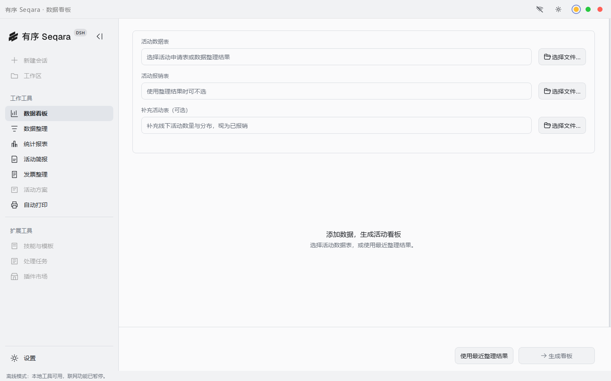
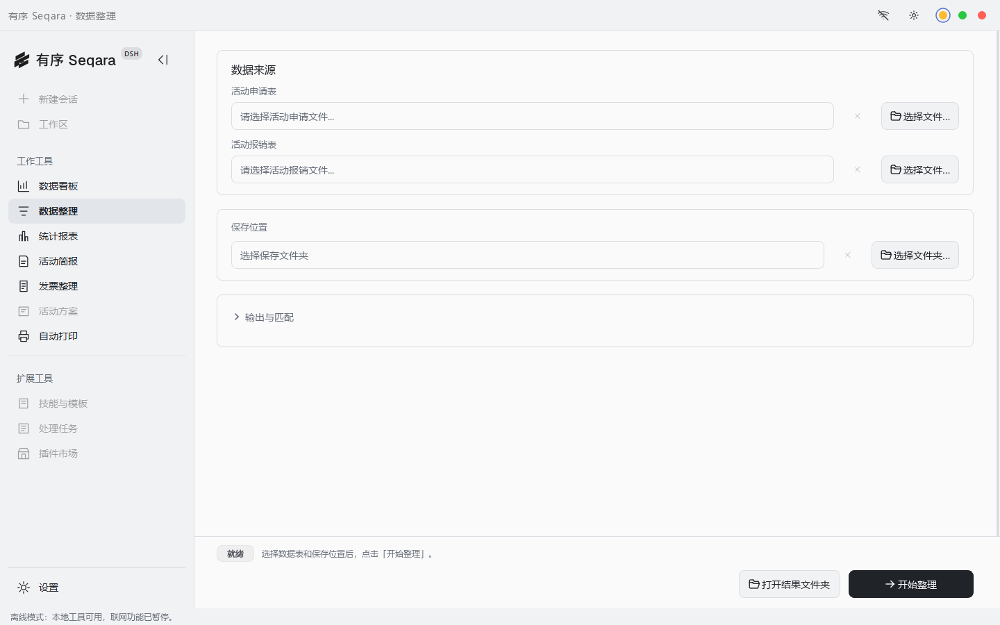
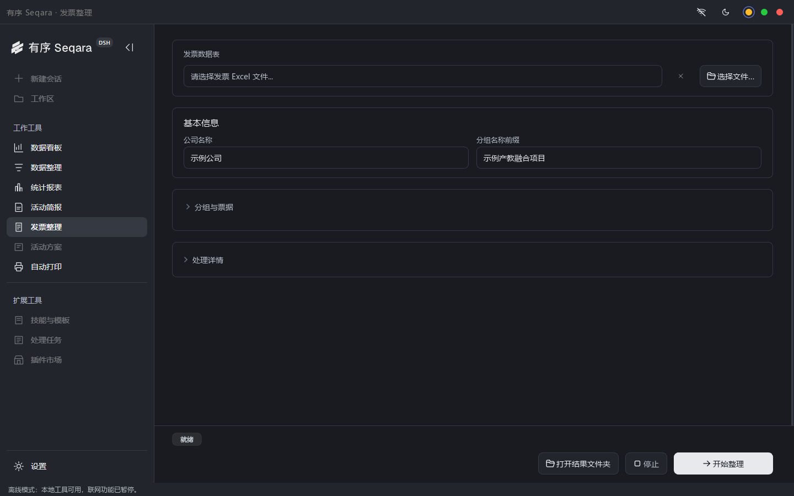

<div align="center">

# 有序 · Seqara Harness -demo

**让复杂工作，有序发生。**

Windows 桌面工作台 · 本地业务工具 · DeepSeek Harness 集成

[快速开始](#快速开始) · [界面预览](#界面预览) · [功能范围](#功能范围) · [隐私与配置](#隐私与配置) · [开发与验证](#开发与验证)

Apache-2.0 · Windows x64 · Python 3.14 · Node.js 24

</div>


Seqara 把日常表格整理、业务统计、Word 文档和智能会话放进同一个桌面窗口。常用工具可以直接操作；配置模型后，也可以在会话中调用业务工具并打开生成的文件。

这是从 Seqara 0.8 整理出的独立公开演示版，版本为 **0.8.0-demo.1**。真实业务案例、公司与院校名单、账号配置、内部会话及原有 PPT 编译引擎均未包含在此版本中。项目是独立桌面集成，**不是 DeepSeek 官方桌面发行版**。

## 界面预览

以下为公开版在隔离配置目录中实际运行的界面截图，未使用原有账号、会话或业务数据。截图展示离线模式，联网功能需另行配置。

### 数据看板

导入活动台账后，查看活动、院校、师生人数及月份分布。空白状态不展示虚构的业务指标。



### 数据整理

活动申请与报销记录集中处理，支持院校识别、类型整理和结果导出。



### 发票整理与深色主题

配置公司和分组参数，将发票明细整理成可继续编辑的工作簿。



## 功能范围

| 功能 | 公开版能力 | 条件 |
| --- | --- | --- |
| 智能工作台 | 工作区、会话、模型设置、技能与提示词库 | 自行配置模型服务 |
| 数据看板 | 台账统计、月份筛选、补充数据、结果恢复 | 本地表格 |
| 数据整理 | 活动与报销关联、院校拆分、数据清洗 | 符合输入列结构的表格 |
| 统计报表 | 按业务口径导出 Excel | 本地表格 |
| 活动简报 | 将活动正文或新闻内容整理为 Word | 本地正文可离线；抓取新闻需联网 |
| 发票整理 | 分类、分组、封面与结果导出 | 配置自己的公司与项目 |
| 活动方案 | 模型辅助撰写与 Word 排版 | AI 撰写需模型连接 |
| 文档转换与打印 | 调用 Word/WPS 转换、提交打印 | 对应办公软件、打印设备和用户确认 |
| 图片观察 | 可选 ModLens 视觉服务接口 | 单独安装、配置插件和模型 |

本版不提供内置 PPT 制作、PPT 风格图库或原有内部案例模板。通用附件交付、文件打开和已有材料解析代码仍保留。表格业务规则以活动台账场景为基础，并非任意表格的自动理解器。

## 快速开始

准备 Windows 10/11 x64、**Python 3.14 x64**、**Node.js 24 LTS** 和 Git。安装时将 Python、Node.js 加入 PATH。

```powershell
git clone https://github.com/xiaochaixiong/Seqara-Harness-demo.git
cd Seqara-Harness-demo
powershell -NoProfile -ExecutionPolicy Bypass -File scripts/setup-dev.ps1
powershell -NoProfile -ExecutionPolicy Bypass -File scripts/start-dev.ps1
```

安装脚本创建项目内 `.venv`，安装 Python 和锁定的 npm 依赖，并应用本版针对 Harness 界面的兼容补丁。首次安装需要联网。

如果 Python 使用自定义路径：

```powershell
./scripts/setup-dev.ps1 -PythonPath (Get-Command python).Source
```

配置完成后，也可双击根目录的 `启动开发版.cmd`。源码运行不需要预先打包 worker.exe，也不需要复制内部版运行目录。

### 首次使用

1. 本地工具：打开左侧工作工具，选择自己的输入文件和输出目录。
2. 公司规则：进入设置，填写公司名称、项目名称及公司对应的院校；预置名单为空，示例名称不代表真实单位。
3. 智能会话：在模型设置中填写自己的服务地址、模型和 API Key。业务方案生成的 API 设置与工作台模型配置分别管理。
4. 离线使用：使用窗口顶部联网开关。模型请求、在线新闻和插件安装需要联网。

不要把 API Key 写入源码、截图或 Issue。模型服务可能产生费用；本项目不附带账号或额度。

## 隐私与配置

公开版默认使用独立目录：

```text
%APPDATA%/SeqaraHarnessDemo/
```

不会自动读取或迁移其他 Seqara 安装的数据。设置、会话、导出记录与浏览器缓存可能包含用户材料，应由使用者管理。API 配置按现有实现保存为本机配置文件，不应视为加密凭据保险箱。

使用本地业务工具不需要上传整个项目。调用模型、视觉服务或在线新闻功能时，对应材料会按功能需要发送到所配置的服务。安装和更新会访问软件包源；第三方插件有自己的网络行为。离线开关仅控制本应用，不控制外部 Word/WPS、打印机或系统网络。

公开源文件通过 Git 清单、凭据模式扫描和 Office 文档检查进行复核；自动扫描不能识别所有形式的敏感信息。对外提交前仍应检查新增附件和截图。详见 [隐私边界](docs/PRIVACY.md) 和 [安全报告方式](SECURITY.md)。

## 开发与验证

```powershell
# 界面补丁、Node 测试、Python 测试及公开文件扫描
./scripts/test.ps1

# 仅检查拟公开文件
./.venv/Scripts/python.exe scripts/audit-public.py

# 生成隔离配置下的真实截图
./.venv/Scripts/python.exe scripts/capture-demo.py
```

测试以合成输入和本地模拟模型为主，不要求真实 API Key。Windows CI 配置位于 `.github/workflows/ci.yml`。实际执行结果与尚需人工验证的能力见 [验证记录](docs/VALIDATION.md)。

### 构建桌面目录

完成安装、测试并提交源码后运行：

```powershell
./scripts/package-native.ps1
```

生成目录为 `release/Seqara-v0.8.0-demo.1/`。整个目录共同构成桌面程序，不能单独复制 EXE。发布目录必须不存在，脚本会拒绝与旧产物混合。打包使用 Git 跟踪的运行源码和重新安装的 npm 依赖，不复制用户 AppData。

## 项目结构

```text
native/                  PySide6 桌面界面与本地业务模块
backend/                 独立业务 worker 与材料解析
desktop/                 Harness 进程、离线规则和更新管理
runtime/toolkit-brand/   工作台界面集成
runtime/toolkit-plugin/  业务工具、文件交付、可选视觉接口
scripts/                 安装、测试、截图、审查和构建
tests/                   合成数据回归与公开版边界检查
docs/                    公开说明与界面图片
```

## 贡献与许可

欢迎通过 Issue 报告可复现问题，或提交改进。请用合成数据复现，不要上传真实发票、客户资料、会话日志或凭据。贡献步骤见 [CONTRIBUTING.md](CONTRIBUTING.md)。

自有代码采用 [Apache License 2.0](LICENSE)。第三方依赖保留各自许可，不因本项目使用 Apache-2.0 而更改；参见 [THIRD_PARTY_NOTICES.md](THIRD_PARTY_NOTICES.md) 和 [NOTICE](NOTICE)。
